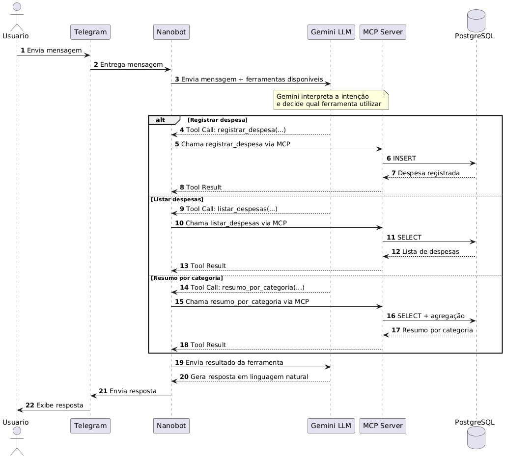

# 💬 Orçamento Conversacional — Gestão financeira pessoal por linguagem natural, direto no Telegram

<p align="center">
  <picture>
    <source
      media="(prefers-color-scheme: dark)"
      srcset="https://raw.githubusercontent.com/vinimeurer/orcamento-conversasional/main/docs/assets/banner-dark.png">
    <source
      media="(prefers-color-scheme: light)"
      srcset="https://raw.githubusercontent.com/vinimeurer/orcamento-conversasional/main/docs/assets/banner-light.png">
    
  </picture>
</p>

<p align="center">
  <a href="https://www.python.org/">
    
  </a>
  <a href="https://www.docker.com/">
    
  </a>
  <a href="https://www.postgresql.org/">
    
  </a>
  <a href="https://ai.google.dev/">
    
  </a>
  <a href="https://modelcontextprotocol.io/">
    
  </a>
  <a href="LICENSE">
    
  </a>
</p>

Registre despesas como quem manda mensagem para um amigo — sem formulário, sem planilha. Um agente de IA (Google Gemini, orquestrado pelo [Nanobot](https://github.com/HKUDS/nanobot)) interpreta a mensagem, extrai valor, categoria, método de pagamento e data, e grava tudo em um banco PostgreSQL. Quando você quiser, ele te devolve um relatório em PDF com dashboard completo.

```
Você:  Gastei 35 no almoço hoje, no pix
Bot:   Registrado: R$ 35,00 em alimentação (almoço, no pix).
```

## Índice

- [Visão Geral](#visão-geral)
- [Funcionalidades](#funcionalidades)
- [Arquitetura](#arquitetura)
- [Requisitos](#requisitos)
- [Como Executar](#como-executar)
- [Comandos](#comandos)
- [Estrutura do Projeto](#estrutura-do-projeto)
- [Documentação Técnica](#documentação-técnica)
- [Licença](#licença)

## Visão Geral

Este é um protótipo de pesquisa que investiga a viabilidade de uma interface **100% conversacional** para controle financeiro pessoal, com foco em jovens adultos (18–29 anos). A ideia central: em vez de adaptar o usuário à estrutura de um app, o sistema se adapta à forma como a pessoa já fala naturalmente sobre seus gastos.

Todo o pipeline roda em containers Docker — não é preciso instalar Python, Postgres ou o Nanobot na máquina. O modelo de linguagem (Google Gemini) roda na nuvem, então não há download nem execução de modelo local.

## Funcionalidades

| Funcionalidade | Descrição |
| --- | --- |
| 📝 **Registro por linguagem natural** | Extrai valor, descrição, categoria, método de pagamento e data de uma mensagem comum, sem campos ou comandos estruturados |
| 🔍 **Consultas em linguagem natural** | "Quanto gastei em alimentação esse mês?", "Quanto gastei entre 01/08 e 15/08?" |
| 📊 **Resumo por categoria** | Total e participação percentual de cada categoria num período |
| 📄 **Relatório em PDF (dashboard, 3 páginas)** | Enviado direto no Telegram: **(1)** panorama por categoria, **(2)** panorama por método de pagamento, **(3)** tabela detalhada de gastos por dia |

## Arquitetura



| Camada | Tecnologia | Papel |
| --- | --- | --- |
| Canal | Telegram Bot API | Entrada e saída das mensagens |
| Orquestração | [Nanobot](https://github.com/HKUDS/nanobot) | Conecta canal, modelo e ferramentas |
| Modelo de linguagem | Google Gemini (API) | Interpretação e geração de respostas |
| Ferramentas | Protocolo MCP, Python | Regras de negócio (registro, consulta, relatório) |
| Persistência | PostgreSQL | Armazenamento estruturado |
| Geração de PDF | ReportLab + Matplotlib | Dashboard do relatório |
| Empacotamento | Docker Compose | Orquestra os containers `postgres` e `nanobot` |

O servidor de ferramentas roda **dentro do container do Nanobot**, via stdio, em um ambiente Python isolado (`/opt/mcpvenv`) — necessário porque o SDK `mcp` usado pelas ferramentas conflita em versão com o exigido pelo próprio `nanobot-ai`. Detalhes em [Documentação Técnica](#documentação-técnica).

## Requisitos

- **Docker** e **Docker Compose** (Docker Desktop no Windows/Mac, Docker Engine no Linux) — é a única dependência real
- Uma conta no **Telegram**, para criar o bot
- Uma **chave de API do Google Gemini** (gratuita, sem cartão de crédito — free tier cobre o uso deste projeto)

Não precisa instalar Python, Postgres ou o Nanobot separadamente — tudo roda em container.

## Como Executar

```bash
# 1. Copie o modelo de variáveis de ambiente
cp .env.example .env

# 2. Edite o .env com seu TELEGRAM_TOKEN e GEMINI_API_KEY
#    (veja como conseguir os dois na Documentação Técnica)

# 3. Suba tudo
make up
# equivalente: docker compose up -d --build

# 4. Confira se os dois serviços estão de pé
make ps
# equivalente: docker compose ps
```

Procure seu bot no Telegram pelo username criado no BotFather e mande uma mensagem. O passo a passo completo — de onde tirar o token do bot e a chave do Gemini até o troubleshooting de cada erro comum — está na **[Documentação Técnica](./docs/DOCUMENTACAO_TECNICA.md)**.

## Comandos

Atalhos definidos no `Makefile` (opcional — todo comando `make` tem o `docker compose` equivalente ao lado, caso você não tenha `make` instalado, comum no Windows fora do WSL).

| `make` | Equivalente Docker Compose | O que faz |
| --- | --- | --- |
| `make up` | `docker compose up -d --build` | Constrói as imagens (se necessário) e sobe tudo em segundo plano |
| `make down` | `docker compose down` | Para os containers, **mantendo** os dados do banco |
| `make restart` | `docker compose restart nanobot` | Reinicia só o Nanobot (após mudar `.env`, `SOUL.md` ou `config.docker.json`) |
| `make logs` | `docker compose logs -f nanobot` | Acompanha os logs do Nanobot em tempo real (`Ctrl+C` só sai da visualização) |
| `make ps` | `docker compose ps` | Mostra o status dos containers |
| `make build` | `docker compose build` | Reconstrói as imagens sem subir os containers |
| `make reset` / `make clean` | `docker compose down -v` | ⚠️ Para tudo e **apaga os volumes** (dados do Postgres inclusive) |
| `make view-db` | `docker exec -it orcamento_postgres psql -U orcamento -d orcamento` | Abre um shell `psql` dentro do banco, para consultas manuais |

Casos que não têm atalho no `Makefile` e usam `docker compose` direto:

| Comando | Quando usar |
| --- | --- |
| `docker compose up -d --build nanobot` | Depois de editar código Python em `mcp_server/` ou `db/` (precisa reconstruir a imagem) |
| `docker compose up -d nanobot` | Depois de editar só `.env`, `SOUL.md` ou `config.docker.json` (não precisa reconstruir) |
| `docker compose logs -f` | Ver logs de **todos** os containers, não só o Nanobot |

## Estrutura do Projeto

```
orcamento-conversacional/
├── docker-compose.yml       # Orquestra os containers postgres + nanobot
├── Makefile                 # Atalhos dos comandos acima
├── requirements.txt         # Dependências Python do servidor MCP
├── .env.example             # Modelo de variáveis de ambiente
│
├── db/
│   ├── schema.sql            # Schema para instalação nova (banco vazio)
│   ├── migration_002_metodo_pagamento.sql   # Migração segura para bancos já existentes
│   └── connection.py         # Pool de conexão com o Postgres
│
├── mcp_server/               # Ferramentas do agente + geração do relatório PDF
│   ├── expense_tools.py       # As 4 tools: registrar, listar, resumir, gerar PDF
│   ├── dashboard_builder.py   # Página 1 do relatório (panorama por categoria)
│   ├── dashboard_pagamento.py # Página 2 do relatório (panorama por método de pagamento)
│   ├── dashboard_gastos_dia.py# Página 3 do relatório (tabela de gastos por dia)
│   ├── dash_style.py          # Paleta de cores, nomes e ícones (categorias/métodos)
│   ├── icons.py                # Ícones vetoriais desenhados no PDF
│   └── Dockerfile
│
└── nanobot_config/
    ├── config.docker.json     # Config ativa quando roda via Docker
    ├── config.json             # Config para instalação local (sem Docker)
    ├── SOUL.md                 # Instruções de comportamento do agente
    ├── AGENTS.md                # Regras gerais complementares
    └── Dockerfile
```

Detalhamento completo de cada arquivo, da arquitetura interna e do schema do banco: **[Documentação Técnica](./docs/DOCUMENTACAO_TECNICA.md)**.

## Documentação Técnica

Este README cobre o essencial para rodar o projeto. Para o passo a passo detalhado — incluindo:

- Como conseguir o token do bot no BotFather (com prints do que esperar)
- Como conseguir e configurar a chave da API do Gemini
- Lista completa de problemas comuns e como resolver cada um
- Detalhamento de arquitetura (por que o MCP roda num venv isolado, por que existem dois arquivos de config do Nanobot)
- Instalação local sem Docker
- Referência de cada ferramenta (tool) do agente

veja **[DOCUMENTACAO_TECNICA.md](./docs/DOCUMENTACAO_TECNICA.md)**.

## Licença

Distribuído sob a licença definida em [`LICENSE`](LICENSE).